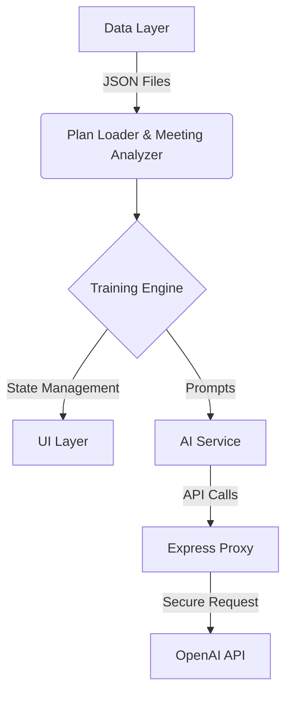

# 🎯 Coach Training Simulator


> **Transforming static sales feedback into an active, AI-driven training experience.**

Coach analyzes sales meetings to provide feedback. This simulator takes it a step further: it allows sales representatives to **practice** their pitch against an AI client *before* the real meeting, using their specific sales plan as a guide.

---

## 🚀 Features

### 📊 Performance Dashboard
A comprehensive overview of your sales skills.
*   **Radar Chart**: Visualize your performance across all 9 sales markers.
*   **Gap Analysis**: Automatically identifies missed or weak markers from previous meetings.
*   **Key Metrics**: Tracks average score, completion rate, and improvement areas.

### 🤖 AI Training Simulator
An interactive role-play environment.
*   **Realistic Simulation**: Practice against an AI client that reacts to your pitch.
*   **Adaptive Scenario**: The AI adjusts its responses based on the sales plan context.
*   **Real-time Feedback**: Get instant scoring (1-5), strength analysis, and actionable advice after every interaction.

### 📝 Deep Dive Analysis
*   **Detailed Breakdowns**: View evaluations for every step of the sales plan.
*   **Meeting Transcripts**: Review past meeting segments with speaker identification.
*   **History Tracking**: Compare your latest training session against past performance.

---

## 🛠️ Technology Stack

This project is built with a focus on **performance**, **modularity**, and **clean architecture**.

| Component | Tech | Description |
| :--- | :--- | :--- |
| **Frontend** |   | Fast, lightweight, no-framework approach for maximum control. |
| **Styling** |  | Custom CSS variables, dark theme, glassmorphism design. |
| **Backend** |   | Proxy server to handle API requests securely. |
| **AI** |  | GPT-4 / GPT-3.5 Turbo for simulation and evaluation. |

---

## 🏗️ Architecture

The application follows a modular architecture to ensure separation of concerns:



*   **`planLoader`**: Parses the sales plan structure.
*   **`meetingAnalyzer`**: Identifies skill gaps from past meetings.
*   **`trainingEngine`**: Manages the simulation state machine.
*   **`evaluator`**: Handles prompt engineering and scoring logic.

---

## 🏁 Getting Started

### Prerequisites
*   Node.js (v18+)
*   npm

### Installation

1.  **Clone the repository**
    ```bash
    git clone https://github.com/EvanEngelsPro/coach-training-simulator.git
    cd coach-training-simulator
    ```

2.  **Install dependencies**
    ```bash
    npm install
    ```

3.  **Configure Environment**
    Create a `.env` file in the root directory:
    ```bash
    cp .env.example .env
    ```
    Add your OpenAI API key:
    ```env
    OPENAI_API_KEY=sk-your-api-key-here
    ```

4.  **Run the Application**
    Start both the frontend and backend servers concurrently:
    ```bash
    npm run dev
    ```
    *   **Frontend**: `http://localhost:5173`
    *   **Backend**: `http://localhost:3001`

---

## 🔮 Future Roadmap

*   [ ] **Voice Mode**: Speak directly to the AI client using Speech-to-Text.
*   [ ] **Multiple Personas**: Train against different client types (skeptical, enthusiastic, executive).
*   [ ] **User Accounts**: Persist progress and history across sessions.
*   [ ] **Custom Plans**: Upload your own sales playbooks.

---

<div align="center">
  <sub>Built with ❤️ by Evan Engels for the Coach AI Team</sub>
</div>
