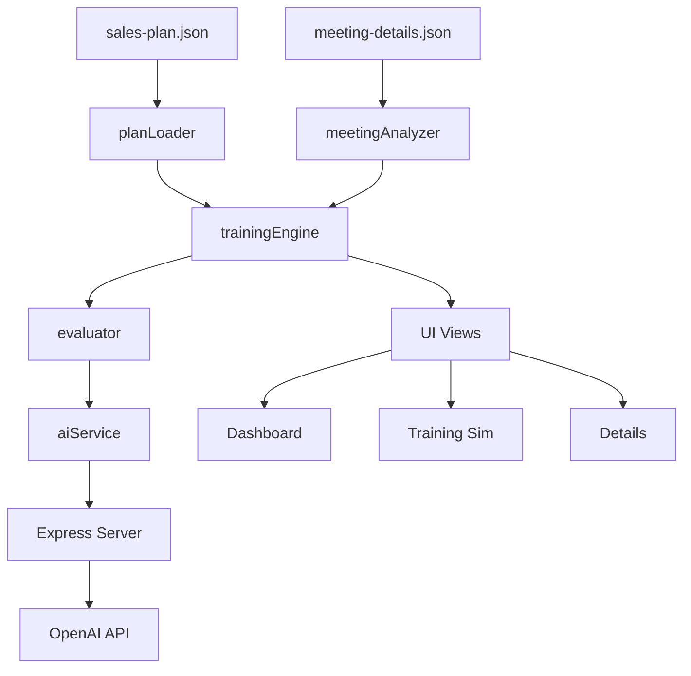

# Coach Training Simulator — Walkthrough

## What Was Built

An **interactive sales training simulator** that transforms static meeting feedback into an active practice platform. The app analyzes past meeting performance and lets sales reps practice against an AI-simulated client, guided by their sales plan.

## Architecture



| Module | Role |
|---|---|
| [planLoader.js](../src/modules/planLoader.js) | Parses 9 sales plan markers |
| [meetingAnalyzer.js](../src/modules/meetingAnalyzer.js) | Cross-references evaluations, computes gaps |
| [trainingEngine.js](../src/modules/trainingEngine.js) | State machine for training sessions |
| [evaluator.js](../src/modules/evaluator.js) | Prompt engineering + mock fallbacks |
| [aiService.js](../src/services/aiService.js) | API calls with graceful degradation |
| [server.js](../server/server.js) | Express proxy to keep API key server-side |

## Screenshots

### Dashboard — Performance Analysis
Radar chart plotting all 9 markers, stat cards, gap priorities.


---

### Training — Chat Simulation
Client IA sends opening message, user practices their pitch.


---

### Training — Evaluation Card
After submitting a response: score, strengths, improvements, actionable advice.


---

### Details — Marker Accordion + Transcript
Full breakdown of all 9 markers with evaluations and 145-segment transcript.


## Recordings


## Verification Results

| Test | Result |
|---|---|
| Dev server starts (Vite + Express) | ✅ No errors |
| Dashboard renders (radar, stats, markers) | ✅ All elements visible |
| Training starts + client responds | ✅ Mock AI responds contextually |
| User submits pitch → evaluation appears | ✅ Score 3/5 + feedback |
| Details accordion + transcript | ✅ 9 markers + 145 segments |
| Console errors | ✅ None (only favicon 404) |

## How to Run

```bash
npm install
npm run dev
# → Vite: http://localhost:5173
# → API:  http://localhost:3001
```

For AI-powered simulation, add `OPENAI_API_KEY=sk-...` to `.env`.
